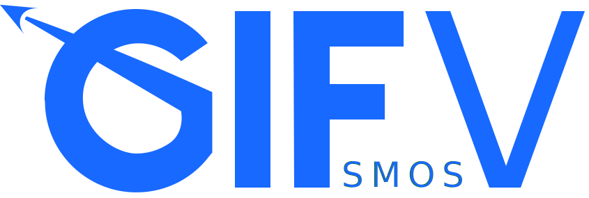

<div align="center">
  
</div>

# GIFsmos V [](https://github.com/jpanneton/gifsmos-v/commits/main) [](https://github.com/jpanneton/gifsmos-v/blob/main/LICENSE.md)

GIFsmos V is a web app for creating vector animations from
[Desmos](https://www.desmos.com/calculator) graphs.

## How it works

As opposed to [GIFsmos](https://github.com/desmosinc/gifsmos), GIFsmos V is using the SVG screenshot format from the Desmos API to capture frames. Then, instead of using [gifshot](https://yahoo.github.io/gifshot) to assemble a GIF from the captured PNG frames, each SVG gets pre-processed and assembled using a JavaScript version of [svgasm](https://github.com/tomkwok/svgasm). Here are the detailed steps:

1. Capture SVG screenshots of the graph using the Desmos API
1. Remove the first `<rect>` element from each SVG (background node)
1. Optimize each SVG using [svgo](https://github.com/svg/svgo)
1. Create a new output SVG containing each input frame as groups (`<g>`) identified by unique IDs
1. Add a `viewBox` attribute to the output SVG with the requested width and height
1. Embed a linear CSS animation that makes each frame visible one after the other using the provided time interval
1. Export the output SVG

## Using GIFsmos V

### Creating, importing and saving graphs

Start by making something dynamic and awesome in the Desmos graphing calculator!
You can do that right inside of GIFsmos V, or you can import one of your saved
graphs from desmos.com by pasting its URL into the expressions list in GIFsmos V,
and it will be automatically imported for you.

Conversely, if you build something great in GIFsmos V that you want to save to
your Desmos account, click "edit graph on Desmos" (at the bottom of the
expressions list or the graph paper), and it will open a copy of your graph on
desmos.com.

To learn more about using the graphing calculator to build cool stuff, check out
the [Learn Desmos](https://learn.desmos.com/graphing) resources.

### Capturing snapshots

GIFsmos V generates your animated SVG from a list of snapshots taken from the
graph paper. You can add a single frame to the list by clicking the camera
button.

GIFsmos V also has a multi-capture mode that lets you generate multiple
snapshots from a slider in the graphing calculator. Open the multi-capture panel
and enter the relevant information in the input fields:

| Option           | Description                                                                     |
| ---------------- | ------------------------------------------------------------------------------- |
| **Slider Index** | the index of the expression that contains the slider values you want to capture |
| **Slider Min**   | the first slider value to capture                                               |
| **Slider Max**   | the last slider value to capture                                                |
| **Slider Step**  | how much to increment the slider in between captures                            |

Finally, click the "Capture" button, and GIFsmos V will automatically capture one
snapshot for each slider value defined by the min, max, and step.

### Previewing

Click the preview button to open the preview panel. You can preview your future
SVG animation either by scrubbing through the snapshots with the slider, or by clicking
the play/pause button on the preview image. The animation will run at (roughly) a speed
determined by the "Interval" option in the settings panel, so it will give you a
good idea what the final SVG animation will look like.

### Adjusting image settings

Click the settings button to open the settings panel. There you can set the
desired image dimensions which will affect how the elements are scaled within the graph
(applies to both the captured snapshots and the final SVG animation),
as well as the interval between frames in the generated SVG.

If the "Oversample" option is checked, images will be captured at double the
nominal dimensions and at a higher pixel density, which is nice for high-density
displays. For instance, an oversampled 300x300 image will actually result in a
600x600 image that looks good on high-density displays when rendered at 300x300.

### Generating and downloading a SVG

Inside the preview panel, once you're happy with the results, click the
"Download SVG" button to generate your final image and save it to your
browser's default download location (named `gifsmos.svg`).

## Developer quick-start

1. Install [Node](https://nodejs.org/en/).
1. Clone the repo.
1. `cd` into the project root.
1. Run `npm install` to install project dependencies.
1. Run `npm start` to start the development server on http://localhost:3000/.

To run the test suite:

```bash
npm test
```

To build a static version of the app:

```bash
npm run build
```

### Image credits

The sidebar icons in GIFsmos V are from the "World Wide Web" collection created by
Dara Ullrich. It can be found here on [The Noun Project](https://thenounproject.com/Dara%20Ullrich/collection/world-wide-web/).
